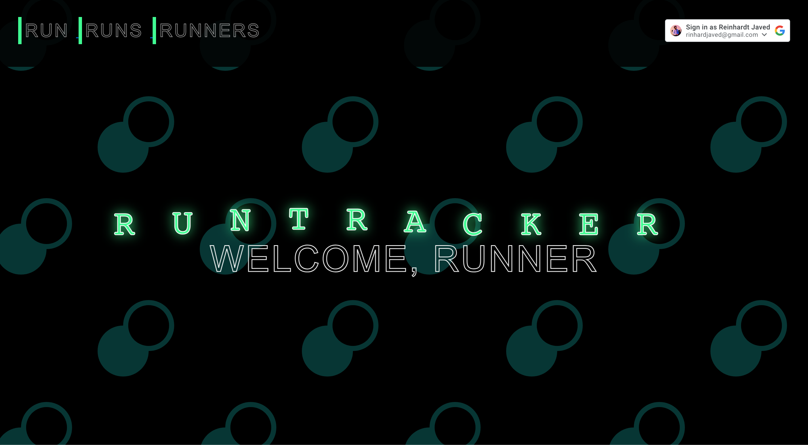

# RUNTRACKER!

 This is a collection site where you can store your own and view other users who run and want to keep a track of their fitness progress. Non-users can view people who have added runs onto the runs page, but that's the only thing non-users can do. Users who sign in have much more feature capabilities such as deleting and editing their personal runs, and the ability to add comments onto others runs as well. As a user you also get to view others who have previously used the application.

## CHECK OUT MY APP! 
<a href='https://run-tracker.fly.dev/'> START </a>

## TECHNOLOGIES USED!

  <li>CSS </li>
  <li>JavaScript </li>
  <li> HTML </li>
  <li> MongoDB </li>
  <li> git </li>
  <li>Google OAuth </li>
  <li>ExpressJS </li>
  <li> NodeJs </li>
  

  ## PLANNING MATERIALS
  <a href='https://trello.com/b/P0VIfD7X/runtracker'> View Planning Materials </a>

## ICEBOX
  
  <li> Add API to view live maps of runners route</li>
  <li>Add details on profile pages where users can view past user runs</li>
  <li>Add Admin privileges to secure and moderate site</li>
  <li> Add a fitness plan page where users can store and update weight progress along with diet     plan
  </li>
  <li>Add responsive design for multiple medias</li>
  <li>Add a calorie calculator to store and update when during fitness journey</li>
  

